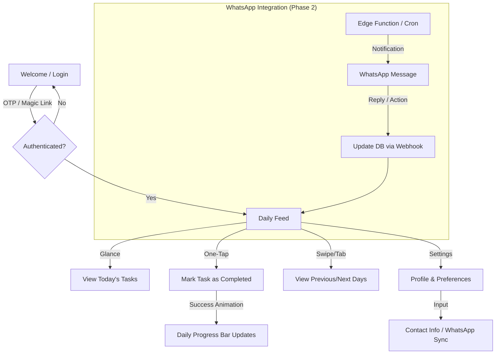

# NAVIGATION_FLOW: Gym-Tracker

## User Journey: Glance & Go

## Screen Flow Details

1. **Authentication**: Mobile-first OTP interface. User enters phone/email, receives code, and is instantly redirected to the feed.
2. **Daily Feed (Main Screen)**:
    - Sticky Header with Date and Progress.
    - Scrollable list of Meals and Workouts.
    - Large "Action Area" for each item.
3. **Execution**: Tapping a task triggers a Framer Motion checkmark animation and updates the DB via optimistic Server Actions.
4. **Navigation**: Minimalistic bottom bar or top tabs for "Today", "History", and "Profile".
